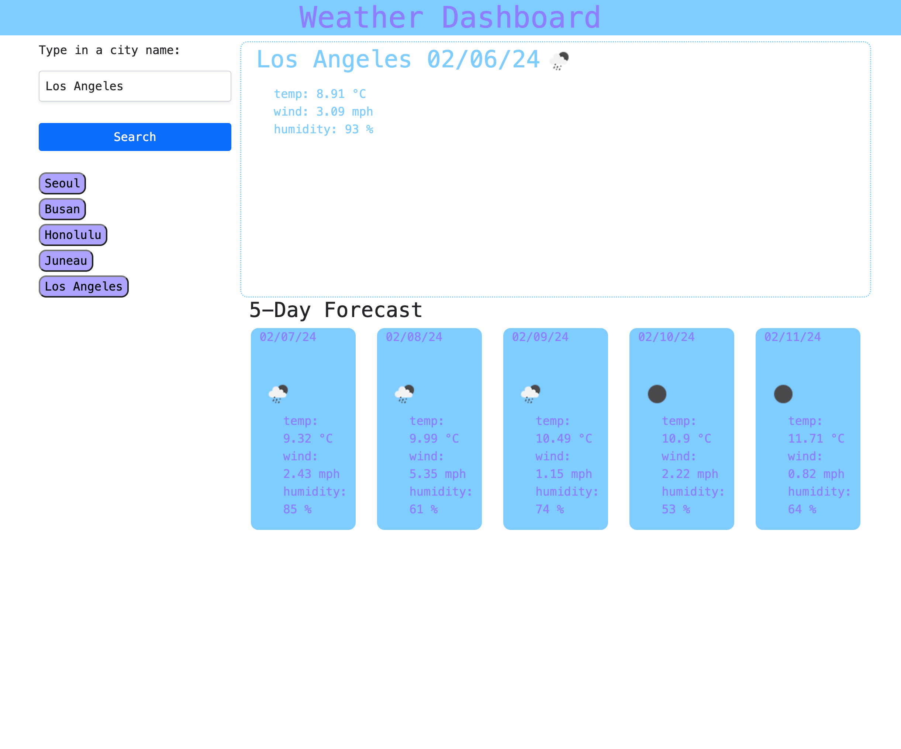

# Weather-Dashboard

## Description

- The purpose of this this challenge was to create a weather dashboard, or an application that allows you to search up any city so that you may see the current weather and five-day forecast for that city. The weather data presented are the temperature, wind speed, and humidity and as well as a weather icon that represents the most probable weather outcome for the day. This project was an interesting experience and I learned how convenient it is to use APIs to grab data.

## Installation

N/A

## Usage
- The way to use this application is straightforward. Type any city on the search form and and press the submit button to get the weather data for that city.

  GitHub page: https://noe-bee.github.io/weather-dashboard/
    
  GitHub repository: https://github.com/noe-bee/weather-dashboard

 

## Credits

Special thanks to Sandrine for helping me grab data with the openweather APIs and my tutor for teaching me how to use template literals for more effecient coding!

## License

Refer to the license on the repository.

---